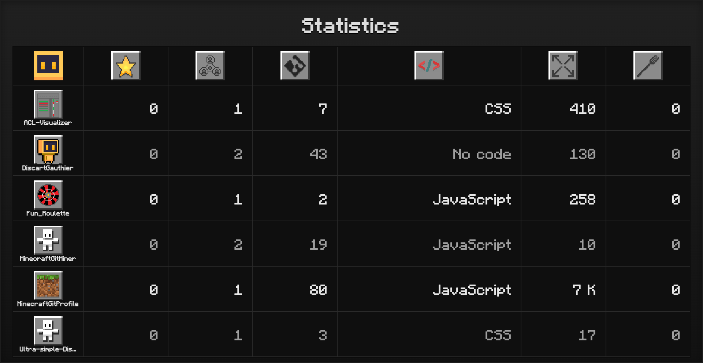

# Minecraft GitHubProfile Stats Panel

A small front-end tool that generates a **Minecraft-style panel** displaying public GitHub repository statistics, with the option to **export the rendered view as a PNG** for inclusion in a README or profile.

<p align="right">
  <a href="README.fr.md">🇫🇷 Français</a> | <a href="README.md">🇬🇧 English</a>
</p>

## Table of Contents

* [Overview](#overview)
* [Features](#features)
* [Requirements](#requirements)
* [Installation](#installation)
* [Configuration](#configuration)
* [Usage](#usage)
* [Typical Structure](#typical-structure)
* [Options & Customization](#options--customization)
* [Troubleshooting](#troubleshooting)
* [Credits](#credits)
* [License](#license)

## Overview

* A GitHub repository panel with: **Stars**, **Contributors**, **Commits**, **Language**, **Size**, **Forks**, and a small Minecraft “head” icon in the top left corner.
  

* If no image is associated with a row, you can **click** the default image and **import your own** (example GIF supported).
  

* A **“Download as PNG”** button captures the panel and saves it locally so you can paste it into your GitHub README.

## Features

* Pixel-art UI inspired by Minecraft (dedicated font) and custom icons for each column.
* Fetches repository statistics through GitHub’s public API for a given username.
* Minecraft-style profile icon fetched using the configured Minecraft username.
* Manual image replacement by **click → select image**.
* One-click **PNG export** powered by *html2canvas*.

## Requirements

* A modern web browser (Chrome, Firefox, Edge, Safari).
* A **static web server** (optional but recommended to avoid asset-loading issues). Examples:

  * **MAMP** (macOS) / **WAMP** (Windows)
  * **Python**: `python3 -m http.server 5500`
  * **Node**: `npx serve` or `npx http-server`

## Installation

1. Copy the project files into a folder accessible by your web server.
2. Verify asset paths:

   * The HTML page references the stylesheet under `style/statistics.css` and loads `script/statistics.js` as a module.
   * Make sure paths and **filename casing** match exactly, especially on case-sensitive systems (Linux).
3. Place your **sprites** in `sprites/` (e.g., `Star.png`, `Contribution.png`, etc.).

## Configuration

Edit `config.js` at the root:

```js
const window = {
  GitHubUsername: 'YourGitHubUsername',
  MinecraftUsername: 'YourMinecraftUsername',
};

export default window;
```

* `GitHubUsername`: the user whose public repositories you want to display.
* `MinecraftUsername`: used to fetch the Minecraft avatar.

## Usage

1. Start the project using **MAMP** (or any static server) and open the `statistics.html` page.
2. Wait for GitHub data and images to load.
3. (Optional) **Replace an image**: click the default image in a row, choose a local image file, and it will apply to that cell.
4. Click ***Download as PNG***: a file like `minecraft-stats-<timestamp>.png` will be generated.
5. In your GitHub README, insert the generated image:

   ```md
   
   ```

   or upload it to an *Issue* / *Release* / *Assets* and use the provided URL.

## Typical Structure

```txt
.
├─ statistics.html
├─ script/
│  └─ statistics.js
├─ style/
│  └─ statistics.css
├─ sprites/
│  ├─ Star.png
│  ├─ Contribution.png
│  ├─ Commit.png
│  ├─ Code.png
│  ├─ Size.png
│  └─ Fork.png
├─ minecraft-font/
│  ├─ info.txt
│  ├─ MinecraftBold-nMK1.otf
│  ├─ MinecraftBoldItalic-1y1e.otf
│  ├─ MinecraftItalic-R8Mo.otf
│  └─ MinecraftRegular-Bmg3.otf
└─ config.js
```

## Options & Customization

* **Custom sprites**: click a cell image to upload your own per-row icon.
* **Font**: the “Minecraft” font is loaded via `@font-face`. You can change the font or its location in the stylesheet.

## Troubleshooting

* **Blank or incomplete PNG**: wait for all images to load, then retry. Some browsers block screenshots of external images unless served via HTTP(S). Always serve the project from a small local server.
* **Font not applied**: check the path to `minecraft-font/MinecraftRegular-Bmg3.otf` and ensure the family name `Minecraft` matches.
* **Missing GitHub data**: GitHub’s public API is rate-limited (60 requests/hour unauthenticated). Try again later. Each load triggers roughly 2n+1 requests, where n is the number of your public repos (max 10 → 21 requests total).

## Credits

* **Minecraft Font**: `MinecraftRegular-Bmg3.otf` (public domain). See `info.txt` and the font’s source page for details.
* **html2canvas** used for PNG capture.

## License

* **Code**: *Project License — Non-Commercial, No-Derivatives (PR-Only) v1.0*.
  Usage and **redistribution as-is** allowed **only** for **non-commercial** purposes.
  **No public forks or derivatives** (private forks allowed only for preparing **PRs**).
  **Attribution required. No warranty provided.**
  See [LICENSE](./LICENSE) for full terms.
  Contributions under **DCO** — see [CONTRIBUTING.md](./CONTRIBUTING.md) and [DCO.txt](./DCO.txt).

* **Font**: “Minecraft” — **Public Domain**. Source:
  [https://www.fontspace.com/minecraft-font-f28180](https://www.fontspace.com/minecraft-font-f28180) (see `info.txt`).
  *Note:* if you load the font through a **CDN/third-party host**, comply with the host’s TOS.

---

> Quick Tips:
>
> * You can run this project **without any build step** (pure HTML+CSS+JS).
> * MAMP works perfectly, but any static server is fine (Python/Node/VSCode Live Server, etc.).
> * The **Download as PNG** button exports exactly what’s visible on screen — resize your window before exporting.
